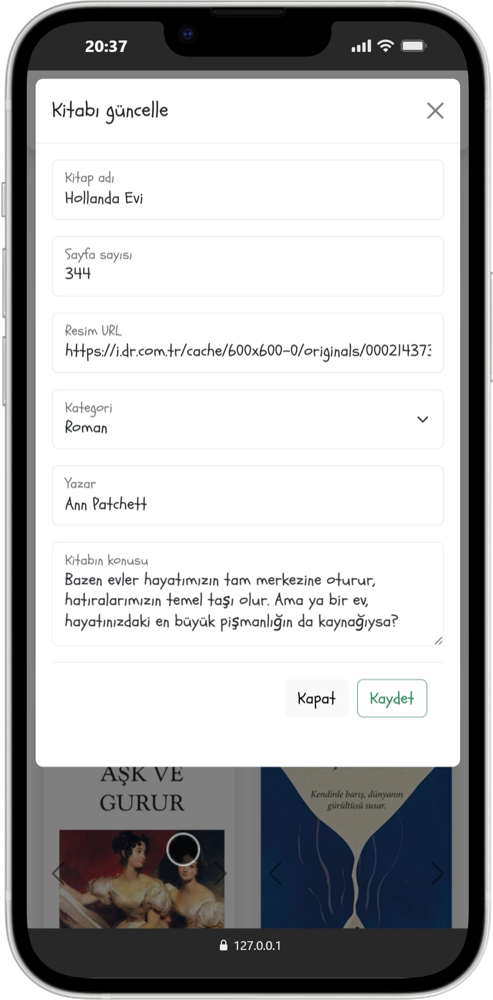

# 📚 BookApp

BookApp is a simple book management application built with Vanilla JavaScript and Bootstrap.  
It allows users to add and remove books dynamically using DOM manipulation.

This project was created to strengthen my understanding of core JavaScript concepts such as:
- DOM manipulation
- Event handling
- Form validation
- Class-based structure in JavaScript
- UI interaction logic

---

## 🚀 Features

- ➕ Add new books
- ❌ Remove books from the list
- 📋 Dynamic UI updates without page refresh
- 🎨 Clean and responsive interface using Bootstrap

---

## 🛠️ Technologies Used

- HTML5
- CSS3
- Bootstrap 5
- Vanilla JavaScript (ES6+)

---

## 📸 Screenshots

### Desktop View

### Mobile View

---

## 📂 Project Structure

